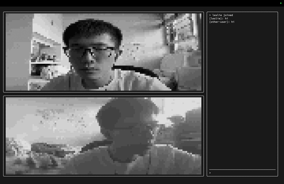
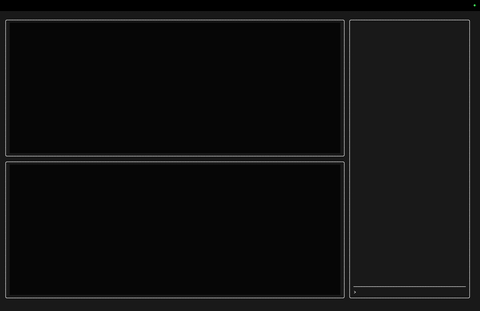
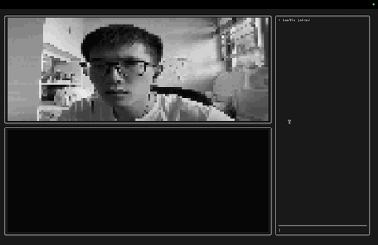

# Terminally Online

> Have you ever thought that Zoom's background blur wasn't strong enough?

Terminally Online is a real-time video-conferencing app that runs entirely in the terminal.
It uses WebSockets for messaging and WebRTC to share media between peers, and is built with a Rust TUI and a Go backend.

## Create a Room

## Send Chat Messages

## Commands

- `/create`: Create a room
- `/join <ID>`: Join a room with the given ID
- `/broadcast`: Start streaming video to peers
