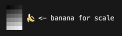

# Client

## Quick Start

1. Create an `.env` file:

```
HOST=<host>
```

2. Start the client:

```
cargo run
```

## Implementation

### Webcam

The [`nokhwa`](https://crates.io/crates/nokhwa) crate was used to request frames from the device's webcam.
Frames are requested from the webcam in a separate thread that runs a constant loop to maintain a live video feed.

Frames are received as RGB, which is convenient for rendering a grayscale webcam feed to the local user.
However, sending frames to peers requires additional processing:

1. Convert RGB to [Y'UV format](https://en.wikipedia.org/wiki/Y%E2%80%B2UV)
2. Encode as [H.264](https://en.wikipedia.org/wiki/Advanced_Video_Coding) using [`openh264`](https://crates.io/crates/openh264)
3. Chunk into [NAL](https://en.wikipedia.org/wiki/Network_Abstraction_Layer) unit samples for transmission

On the receiving end, the received samples would then need to be reconstructed into a H.264 stream and subsequently decoded.

For both local and peer video streams, video streams are handled by a `VideoHandler`.
Before being displayed, each frame is scaled to fit their allotted area in the terminal using [bilinear interpolation](https://en.wikipedia.org/wiki/Bilinear_interpolation).

### Video

Normally, videos consist of frames, and those frames consist of square pixels.`
Unfortunately, characters in the terminal aren't square.

That's where the unicode upper half block character (▀) comes in to play.
Since characters and backends can be colored using [ANSI escape codes](https://en.wikipedia.org/wiki/ANSI_escape_code),
each row in the terminal can represent 2 rows of pixels, with the foreground color as the top pixel's color and the background color as the bottom pixel's color:



The [`cursor`](https://crates.io/crates/cursor) crate was used to simplify printing and coloring output to the terminal.

### Peer-to-Peer Communication

The [`webrtc`](https://crates.io/crates/webrtc) crate was used to handle media broadcasts between clients.
More details on WebRTC in [the server's README](../server/README.md).

## Compatibility

Tested on WSL and MacOS.

### Additional Setup for WSL

Attach webcam to WSL client:

```
# Command Prompt
usbipd attach --wsl --busid <busid>

# WSL
modprobe uvcvideo
chgrp video /dev/video0
chmod 660 /dev/video0
```
